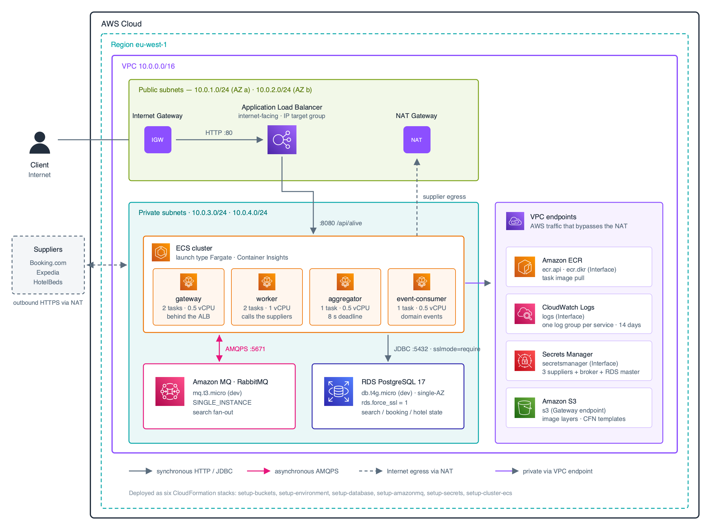

# ECS Fargate: Deploying the Supplier Gateway

Supporting repository for the article **ECS Fargate: Deploying Complex
Microservices on AWS** ([draft](../articoli-medium/articoli/ecs-fargate-supplier-gateway/bozza-it.md)).

Defines the AWS infrastructure to host the four microservices of the
Supplier Gateway (gateway, worker, aggregator, event-consumer) on **ECS
Fargate**, with **AmazonMQ managed**, **Secrets Manager**, **VPC endpoints**
and **Container Insights**.

> **Status**: proposed design. The CloudFormation templates describe
> the architecture described in the article. For actual deployment of
> the current gateway code, modifications to the task definitions are
> required (the current implementation is a single Spring Boot application,
> not four distinct services).

## Quick start (from AWS CloudShell)

```bash
# 1. Clone this repo (or this tutorial) into CloudShell
git clone <repo-url> && cd aws-tutorials/aws-ecs/ecs-fargate-supplier-gateway

# 2. Copy the parameter files and customize
for step in setup-buckets setup-environment setup-amazonmq setup-secrets setup-cluster-ecs; do
  cp templates/$step/parameters.json.dist templates/$step/parameters.json
done

# 3. Edit the parameter files with real values
#    - setup-cluster-ecs: ContainerImage (ECR URI), VpcId/Subnet, SecretArn,
#                         DBEndpoint/DBPort/DBName/DBSecretArn/BrokerSecretArn
#    (DB and broker passwords are no longer in the parameter files: they live
#    in Secrets Manager and are retrieved by tasks via the `secrets:` key)

# 4. Deploy step-by-step (order matters)
make deploy STEP_NAME=setup-buckets
make deploy STEP_NAME=setup-environment
make deploy STEP_NAME=setup-database
make deploy STEP_NAME=setup-amazonmq
make deploy STEP_NAME=setup-secrets
make deploy STEP_NAME=setup-cluster-ecs

# 5. Cleanup (reverse order)
make delete STEP_NAME=setup-cluster-ecs
make delete STEP_NAME=setup-secrets
make delete STEP_NAME=setup-amazonmq
make delete STEP_NAME=setup-database
make delete STEP_NAME=setup-environment
make delete STEP_NAME=setup-buckets
```

No AWS profiles to configure: **CloudShell automatically uses the IAM
credentials of the user logged into the console**.

## Architecture

See [docs/architecture.md](docs/architecture.md) for the design decisions
in detail.

<p align="center">
  
</p>

## Project structure

```
ecs-fargate-supplier-gateway/
├── README.md                              this file
├── makefile                               deploy orchestrator (CloudShell-friendly)
├── .gitignore
├── docs/
│   ├── architecture.md                    architectural details
│   ├── architecture.svg                   diagram source (official AWS icons)
│   ├── architecture.png                   raster export, 2x
│   ├── build-architecture-svg.py          inlines the icons, exports the PNG
│   └── icons/README.md                    slot -> shared icon library mapping
└── templates/
    ├── setup-buckets/                     step 1 — S3 bucket for CF templates
    │   ├── main-stack.yaml
    │   ├── parameters.json.dist
    │   └── README.md
    ├── setup-environment/                 step 2 — VPC + subnets + NAT + VPC endpoints
    │   ├── main-stack.yaml
    │   ├── vpc.yaml
    │   ├── parameters.json.dist
    │   └── README.md
    ├── setup-database/                    step 3 — RDS PostgreSQL 17
    │   ├── main-stack.yaml
    │   ├── parameters.json.dist
    │   └── README.md
    ├── setup-amazonmq/                    step 4 — managed RabbitMQ broker
    │   ├── main-stack.yaml
    │   ├── parameters.json.dist
    │   └── README.md
    ├── setup-secrets/                     step 5 — Secrets Manager for suppliers
    │   ├── main-stack.yaml
    │   ├── parameters.json.dist
    │   └── README.md
    └── setup-cluster-ecs/                 step 6 — cluster, ALB, 4 task definitions, 4 services
        ├── main-stack.yaml
        ├── parameters.json.dist
        └── README.md
```

## Deployment order

| # | Step | What it creates | Estimated time |
|---|---|---|---|
| 1 | `setup-buckets` | S3 bucket for templates | ~30s |
| 2 | `setup-environment` | VPC + 4 subnets + NAT + 5 VPC endpoints | ~3 min |
| 3 | `setup-database` | RDS PostgreSQL 17 | ~10 min |
| 4 | `setup-amazonmq` | Managed RabbitMQ broker | ~10 min |
| 5 | `setup-secrets` | 5 placeholder secrets in Secrets Manager | ~30s |
| 6 | `setup-cluster-ecs` | ECS cluster + ALB + 4 tasks + 4 services | ~3 min |

## Estimated costs

| Component | Tutorial | Production |
|---|---|---|
| Fargate (4 services) | ~$144/mo | ~$144/mo |
| ALB | ~$22/mo + LCU | ~$22/mo + LCU |
| NAT Gateway | ~$32/mo | ~$32/mo |
| VPC Endpoints (4 Interface + 1 Gateway) | ~$28/mo | ~$28/mo |
| AmazonMQ (mq.t3.micro / mq.m5.large) | ~$15/mo | ~$130/mo |
| RDS PostgreSQL (db.t4g.micro / db.t3.small Multi-AZ) | ~$13/mo | ~$52/mo |
| CloudWatch Logs + Insights | ~$8/mo | ~$15/mo |
| Secrets Manager (5 secrets + DB) | ~$2/mo | ~$2/mo |
| **Total** | **~$264/mo** | **~$425/mo** |

Without VPC endpoints (i.e. all traffic via NAT): ~$80 more per month.

## Differences from the current gateway code

The real `hotel-supplier-gateway`
is a **single Spring Boot application** running as one process
with internal bounded contexts (search, booking, hotel, shared). The workers
are RabbitMQ consumers inside the same JVM, not separate processes.

The article instead proposes a design with **four separate Fargate services**
from the same Docker image, differentiated by
`SPRING_PROFILES_ACTIVE`. For actual deployment, modifications to the
gateway code are needed:

1. Add the `gateway`, `worker`, `aggregator`, `event-consumer` profiles
   to `application.properties` with `@Profile` or `@ConditionalOnProperty`
   on the beans that belong to each service.
2. Change `spring.main.web-application-type` to `reactive` or `servlet`
   depending on the service (the worker must not expose HTTP).
3. Add `@ConfigurationProperties` to read `RABBITMQ_HOST`,
   `RABBITMQ_PORT`, `SEARCH_DEADLINE_SECONDS` from env vars.

These changes are **out of scope** for this tutorial — the tutorial
describes the design proposed by the article.

## Links

- AWS ECS best practices: <https://docs.aws.amazon.com/AmazonECS/latest/bestpracticesguide/intro.html>
- AWS patterns for Java microservices: <https://docs.aws.amazon.com/prescriptive-guidance/latest/patterns/deploy-java-microservices-on-amazon-ecs-using-aws-fargate.html>
